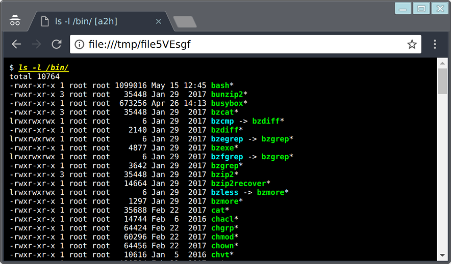

# Zenlog

Zenlog is a wrapper around a login shell to save all command output to a separate log file for each command automatically, so you no longer need to use tee(1) to keep log files.

The the current version is v4.

Old versions (v0 and v1) worked with bash <= 4.3. Newer versions (v2, written in Perl, and v4, rewritten in Ruby) require PS0 support, which is new in bash 4.4 (aka pre-exec hook).
 
## How it works

[The version 0 script](v0/zenlog) shows the basic idea, which is "start a login shell within script(1) and let it log all terminal I/O to a file, but instead of logging to an actual file, pass it to a logger script via a pipe, and let the script detect each command start/end and save the output to separate log files."

Originally the logger script detected command start and finish by detecting special markers embedded in the command prompt. The command start and stop markers were ANSI escape sequences that wouldn't show up in the terminal and were made redundant so a sane program would never output. "Redundant" means that, for example, `\e[0m` is a sequence to reset character attributes which is frequently used, and `\e[000000m` technically has the same meaning but no one would write it this way. Zenlog used sequences like this to pass information from within script(1) to the logger script, without showing it on the terminal.

Since v2, Zenlog requires "pre-exec hook", which is `P0` that was added in Bash 4.4. `P0` and `PROMPT_COMMAND` are used to tell the logger process that 1) when to start logging 2) what the command line is, which is used to create per-command synlinks and "tagging" and 3) when to stop logging.

[The sample bash configuration script](shell/zenlog.bash) shows what command needs to be executed from `P0` and `PROMPT_COMMAND`.

Zenlog still uses special markers to pass the information to the logger process, but they're now directly written to the pipe via `/proc/PID/fd/n`, so they're no longer escape sequences.

Zenlog now also uses another pipe to pass the information from the logger to the shell, which is use to wait until the last log file is closed by `zenlog stop_log`.

## Install and setup

To install, just clone this project:

```
git clone https://github.com/omakoto/zenlog.git
```

Then add the following to your `.bashrc`.
```
source PATH-TO-THIS-FILE/zenlog.bash
```

(Note this will overwrite `P0` and `PROMPT_COMMAND`, so if you don't like it, look at the script and do whatever you want.)

### Using other shells

Any shell should work, as long as it supports some sort of "pre-exec" and "post-exec" hooks.

### Optional rubygem installation

Zenlog needs to know the ttyname of the current terminal, and it uses ps(1) to get it by default. However if the [ttyname](https://github.com/samuelkadolph/ruby-ttyname) gem is installed, Zenlog uses it, which is a bit faster.

## Using Zenlog

Once you setup your `.bashrc`, just run `zenlog` to start a new session. As the [Caveats](#caveats) section describes, it's not recommended to use zenlog as a login shell. Just change your terminal app's setting and use zenlog as a custom startup program.

Once in zenlog, output of all commands are stored under `$ZENLOG_DIR` (`$HOME/zenlog/` is the default).

### Opening log files with commands

Try running `ls -l $HOME` and then `zenlog open-last-log`, which should invoke less (`$ZENLOG_VIEWER`) with the output of the `ls` command.

### Opening log files with hotkeys

The `zenlog.bash` script also sets up a hotkey `ALT+1` to open the last log.

Also if you have [A2H](https://github.com/omakoto/a2h-rs) installed, `ALT+2` will open the last log in Google Chrome (change it with `$ZENLOG_RAW_VIEWER`) *with colors*.

[Sample HTML output](res/zenlog-sample.html)



## Log directory structure

For each command, Zenlog creates two log files. One is called "RAW", which is the original output. However because command output often contains colors, RAW log files are hard to read on an editor and also search. So Zenlog also creates anther log file "SAN" (SANitized), which has most standard ANSI sequences removed.

SAN log files have names like this. Basically log filenames contain the timestam, the shortened command line, as well as the comment part in the command line if exists.
```
/home/USER/zenlog/SAN/2017/10/14/14-25-10.778-15193_+ls_-l.log
```

RAW log files have the exact same filename, except they're stored in the `RAW` directory.
```
/home/USER/zenlog/RAW/2017/10/14/14-25-10.778-15193_+ls_-l.log
```

To allow easier access to log files, Zenlog creates a lot of symlinks. (The idea came from [Tanlog](https://github.com/shinh/test/blob/master/tanlog.rb))

```
/home/USER/zenlog/P # The last command SAN output.
/home/USER/zenlog/R # The last command RAW output.
/home/USER/zenlog/PP # Second last SAN log
/home/USER/zenlog/PPP # Third last SAN log
  :
/home/USER/zenlog/RR # Second last RAW log
/home/USER/zenlog/RRR # Third last RAW log
  :
/home/USER/zenlog/cmds/ls/P # The last SAN output from ls
/home/USER/zenlog/cmds/ls/R # The last RAW output from ls
  :
/home/USER/zenlog/tags/TAGNAME/P # The last SAN output with TAGNAME
/home/USER/zenlog/tags/TAGNAME/R # The last RAW output with TAGNAME
  :
```

`TAGNAME` is a comment in command line.

So, for example, if you run the following command:
```
$ cat /etc/fstab | sed '/^#/d' # fstab comments removed
```

You'll get the regular SAN/RAW log files, as well as the following symlinks:
```
/home/USER/zenlog/cmds/cat/P
/home/USER/zenlog/cmds/cat/R

/home/USER/zenlog/cmds/sed/P
/home/USER/zenlog/cmds/sed/R

/home/USER/zenlog/tags/fstab_comments_removed/P
/home/USER/zenlog/tags/fstab_comments_removed/R
```

`zenlog history` shows the most recent SAN log filenames on the current shell (add `-r` to get RAW names):

```
$ zenlog history
/home/USER/zenlog/SAN/2017/10/14/14-26-54.320-15193_+fstab_comments_removed_+cat_etc_fstab_sed_^#_d_#_fstab_c.log
/home/USER/zenlog/SAN/2017/10/14/14-27-26.700-15193_+zenlog_history.log
```

## Subcommands

### Directive commands

* `zenlog start-command COMMANDLINE`

    Run this command in the pre-exec hook to have Zenlog start logging. COMMANDLINE can be obtained with `bash_last_command` which comes with `zenlog she-helper`, which is explained below.

* `zenlog stop-log`

    Run this command in the post-exec hook to have Zenlog stop logging.

    It is guaranteed that when this command returns, both SAN and RAW log files have been all written and closed. So, for example, counting the number of lines with `wc -l` is safe.

### History commands

* `zenlog history [-r]`  Print most recent log filenames.

Example:
```
$ zenlog history
/zenlog/SAN/2017/10/14/16-06-20.773-01908_+ls_etc_.log
/zenlog/SAN/2017/10/14/16-06-32.075-01908_+cat_etc_passwd.log
/zenlog/SAN/2017/10/14/16-06-40.080-01908_+zenlog_history.log

$ zenlog history -r
/zenlog/RAW/2017/10/14/16-06-20.773-01908_+ls_etc_.log
/zenlog/RAW/2017/10/14/16-06-32.075-01908_+cat_etc_passwd.log
/zenlog/RAW/2017/10/14/16-06-40.080-01908_+zenlog_history.log
/zenlog/RAW/2017/10/14/16-07-02.976-01908_+zenlog_history_-r.log
```

* `zenlog history [-r] -n NTH`  Print NTH last log filename.

```
$ cat /etc/passwd
  :
$ zenlog history -n 1
/zenlog/SAN/2017/10/14/16-08-32.236-01908_+cat_etc_passwd.log
```

* `zenlog open-last-log [-r]` Open last log file. `-r` to open RAW instead of SAN.
* `zenlog open-current-log [-r]` Open current log file. `-r` to open RAW instead of SAN.

* `zenlog last-log [-r]` Print last log file name. `-r` to show RAW name instead of SAN.

* `zenlog current-log [-r]` Print current log file name. `-r` to show RAW name instead of SAN.

    `last-log` and `current-log` are useful for scripting. `current-log` is useful when executing a command *on* the command line prompt. For example, on Bash, you can define a hotkey to launch a command with `bind -x`. Using this, `bind -x '"\e1": "zenlog open-current-log"'` allows you to open the last log file with pressing `ALT-1`.


### Shell helper functions

The following are shell *functions* that can be installed with:
```
. <(zenlog sh-helper)
```

The included functions are:

* `in_zenlog` returns success status when the shell is in a Zenlog session.

    This is actually an alias to `zenlog in-zenlog`.

    Example:
```
$ in_zenlog && echo "in-zenlog!"
$ zenlog in-zenlog && echo "in-zenlog!"
```


* `184` executes a command passed as an argument without logging.

    Example: This will print the content of the `a_huge_file_that_not_worth_logging` file without logging it.
```
$ 184 cat a_huge_file_that_not_worth_logging
```

* `186` executes a command with logging, even if a command contains NO_LOG commands. ("man" is included in the default no log list, so normally the output won't be logged. See `ZENLOG_ALWAYS_NO_LOG_COMMANDS` below.)

    Example: This runs `man bash` with logging it.
```
$ 186 man bash
```

* `bash_last_command` shows the most recent command line. Intended to be used with `start-command`. See [the sample bash config file](shell/zenlog.bash).

### Scripting helper commands

* `zenlog fail_if_in_zenlog`

    Return success status only if in a zenlog session.

* `zenlog fail_unless_in_zenlog`

    Return success status only if *not* in a zenlog session.

* `zenlog outer_tty`

    Print the external TTY name, which can be used to print something in the terminal without logging it.

    *Note* if you write to the TTY directly, you'll have to explicitly use CRLF instead of LF. See the following example.

    Example:
```
$ echo -e "This is shown but not logged\r" > $(zenlog outer_tty)
```

* `zenlog logger_pipe`

    Print the pipe name to the logger, which can be used to log something without printing it.

    Example:
```
$ echo "This is logged but not shown" > $(zenlog logger_pipe)
```

* `zenlog write_to_outer`

    Eat from STDIN and write to the TTY directly.

    Example:
```
$ echo "This is shown but not logged" | zenlog write_to_outer
```


* `zenlog write_to_logger`

    Eat from STDIN and write to the logger directly. Note the bellow example actually doesn't really work because `zenlog` is a no log command and the log file content will be omitted. This is normally used in a script.

    Example:
```
$ echo "This is logged but not shown" | zenlog write_to_logger
```

### Other commands

* `zenlog purge-log -p DAYS` Remove logs older than DAYS days.

* `zenlog du [du options]` Run du(1) on the log directory.

* `zenlog free-space` Show the free space size of the disk that contains the log directory in bytes.


## Configuration

### Environmental variables

* `ZENLOG_DIR`

    Log directory. Default is `$HOME/zenlog`.

* `ZENLOG_PREFIX_COMMANDS`

    A regex that matches command names that are considered "prefix", which will be ignored when Zenlog detects command names. For example, if `time` is a prefix command, when you run `time cc ....`, the log filename will be `"cc"`, not `"time"`.

    The default is `"(?:command|builtin|time|sudo)"`

* `ZENLOG_ALWAYS_NO_LOG_COMMANDS`

    A regex that matches command names that shouldn't be logged. When Zenlog detect these commands, it'll create log files, but the content will be omitted.

    The default is `"(?:vi|vim|man|nano|pico|less|watch|emacs|zenlog.*)"`

### RC file

* `$HOME/.zenlogrc.rb`

    If this file exists, Zenlog loads it before starting a session. 

    If you star Zenlog directly form a terminal application, Zenlog starts before the actual login shell starts, so you can't configure it with the shell's RC file. Instead you can configure environmental variables in this file.

## History

* v0 -- the original version. It evolved from a proof-of-concept script, and was bash-perl hybrid, because I wanted to keep everything in a single file, and I also kinda liked the ugliness of the hybrid script. The below script shows the basic structure. ZENLOG_TTY was (and still is) used to check if the current terminal is within Zenlog or not. (We can't just use "export IN_ZENLOG=1" because if a GUI terminal app is launched from within a Zenlog session, it'd inherit IN_ZENLOG. So instead Zenlog stores the actual TTY name and make sure the current TTY name is the same as the stored one. Technically this could still misjudge when the Zenlog session has already been closed and the TTY name is reused, but that's probably too rare to worry about.)

```bash
#!/bin/bash

# initialization, etc in bash

script -qcf 'ZENLOG_TTY=$(tty) exec bash -l' >(perl <(cat <<'EOF'
# Logger script in perl
EOF
) )
```

* v1 -- The hybrid script was getting harder and harder to maintain and was also ugly, so I finally gave up and split it into multiple files. Also subcommands were now extracted to separate files. v1 still had both the Bash part and the Perl part.

 * v2 -- Rewrote entirely in Perl. No more Bash, except in external subcommands.

 * v3 -- First attempt to rewrite in Ruby, but I soon got bored and it didn't happen.

 * v4 -- v2 was still ugly and hard to improve, so finally rewrote in Ruby. This version has a lot better command line parser, for example, which is used to detect command names in a command line. v2's parser was very hacky so it could mis-parse.

# Caveats

* It is not recommended to set zenlog as a login shell, because once something goes wrong, it'd be very hard to recover. Instead, it's recommended to launch it from a terminal program as a custom start command. This way, if Zenlog stops working for whatever reason, you'll be able to switch to a normal shell just by changing the terminal app's setting.

# Relevant work

## A2H ANSI to HTML converter
[A2H](https://github.com/omakoto/a2h-rs) can be used to convert RAW log files into HTML.

## Compromise zenlog completion

[Compromise](https://github.com/omakoto/compromise) has [zenlog shell completion](https://github.com/omakoto/compromise/blob/master/compromise-zenlog.rb) (WIP).
